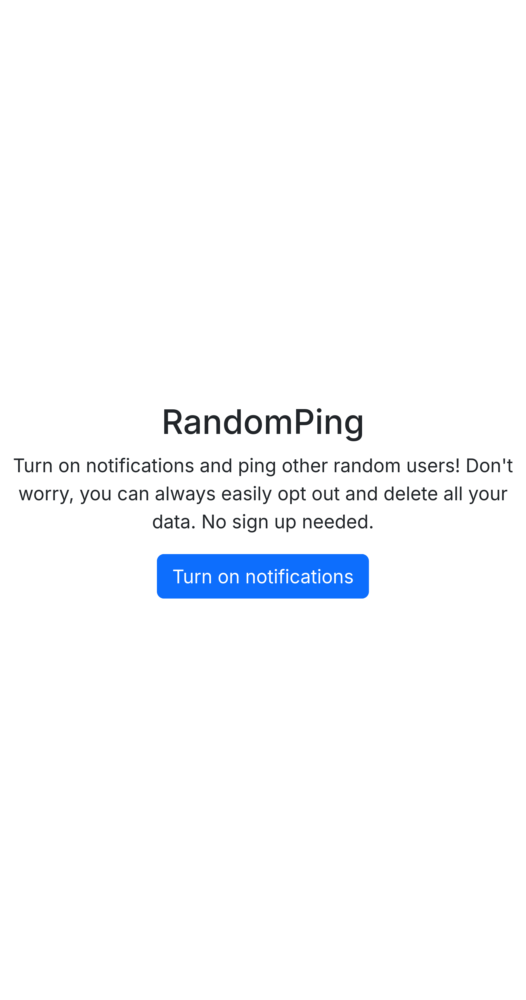
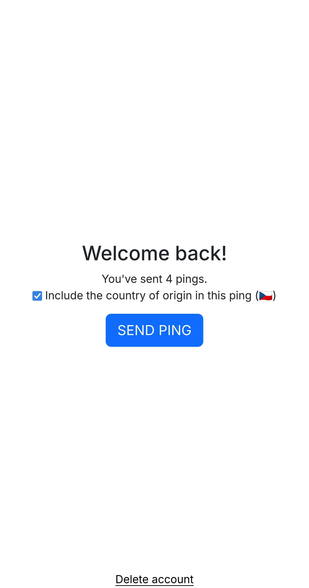
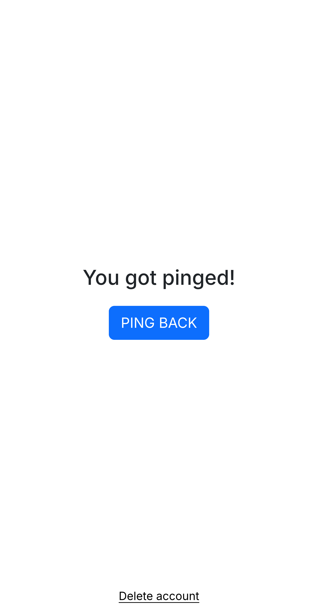

<h1 align="center">RandomPing</h1>

A website allowing you to send push notifications ("pings") to other random users through the [Web Push API](https://developer.mozilla.org/en-US/docs/Web/API/Push_API). You can reply to a ping by interacting with its notification. Developed with [Flask](https://palletsprojects.com/p/flask/) and [Svelte](https://svelte.dev/) using [flask-svelte](https://github.com/priyanshu-shubham/flask-svelte).

## Screenshots

<p align="center">
  
   
  
  
</p>

## Server setup

1. Clone the repository

2. Install required Node packages by running `npm install` in the directory

3. Install required Python packages from `requirements.txt` using `pip install -r requirements.txt`

4. Generate a keypair for the Push API
   
   ```bash
   # Source: https://tech.raturi.in/webpush-notification-using-python-and-flask?x-host=tech.raturi.in
   openssl ecparam -name prime256v1 -genkey -noout -out vapid_private.pem
   
   openssl ec -in ./vapid_private.pem -outform DER|tail -c +8|head -c 32|base64|tr -d '=' |tr '/+' '_-' >> private_key.txt
   openssl ec -in ./vapid_private.pem -pubout -outform DER|tail -c 65|base64|tr -d '=' |tr '/+' '_-' >> public_key.txt
   
   # Combine the keys into `keys.json` and delete the original files
   echo "{\"private\": \"$(cat private_key.txt)\", \"public\": \"$(cat public_key.txt | sed ':a;N;$!ba;s/\n/\\n/g')\"}" > keys.json && rm vapid_private.pem private_key.txt public_key.txt
   ```

5. Build the website assets using `npm run build`

6. Run the Flask webserver located in `app/__init__.py` (it is necessary to run the file itself at least once to create the required database tables)


You can run the development server with live-reload using `npm run dev`. You must however first run `app/__init__.py` to create the database tables.


Note that you may have issues getting the service worker to run outside localhost without an SSL certificate.


---

Ping sound effect source: https://freesound.org/people/Joao_Janz/sounds/478515/